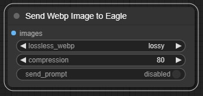
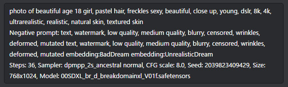
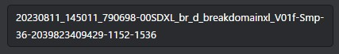
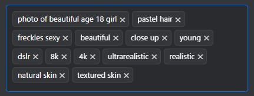

# ComfyUI-send-Eagle(slim)

[](LICENSE)

ComfyUIで生成された画像を、画像管理ソフトウェアEagleに連携するための拡張ノードです。

[English README is here](README.md)

## 目次

- [機能](#機能)
- [インストール](#インストール)
- [使用方法](#使用方法)
- [設定](#設定)
- [テスト](#テスト)
- [貢献](#貢献)
- [ライセンス](#ライセンス)
- [謝辞](#謝辞)
- [変更履歴](#変更履歴)

## 機能

この拡張ノードは、[ComfyUI](https://github.com/comfyanonymous/ComfyUI) で生成された画像を、ローカルで動作している [Eagle](https://en.eagle.cool/) に送信します。



- **画像形式の選択**: `webp` または `png` 形式で画像を送信できます。
  - `webp` 形式では、非可逆圧縮（画質設定）と可逆圧縮を選択可能です。
- **柔軟なテキスト入力**: `prompt_text`、`negative_text`、`memo_text` を直接入力し、Eagleでのアノテーションやタグとして使用できます。これらの入力はオプションです。
- **カスタムフォルダ選択**: 画像を保存するEagle内の `folder_name` を指定できます。指定されたフォルダが存在しない場合、画像はEagleのルートフォルダに保存されます。
- **PNGメタデータ保持**: `png` 形式で画像を保存する場合、ComfyUIのワークフロー情報 (`prompt` および `extra_pnginfo`) がメタデータとして埋め込まれます。これにより、画像をEagleからComfyUIにドラッグ＆ドロップすることで、生成時のワークフローを再現できます。

## インストール

1.  ComfyUIの `custom_nodes` ディレクトリに移動します。
    ```bash
    cd path/to/ComfyUI/custom_nodes
    ```
2.  以下のコマンドでリポジトリをクローンします。
    ```bash
    git clone https://github.com/shingo1228/ComfyUI-send-eagle-slim.git
    ```
3.  ComfyUIを再起動します。

## 使用方法

ComfyUIのワークフローに `Send Image to Eagle` ノードを追加します。


ノードの入力ポートに画像を接続し、必要に応じて以下のパラメータを設定します。

-   `images`: 送信する画像。
-   `format`: 画像の保存形式 (`webp` または `png`)。
-   `lossless_webp`: `webp` 形式の場合、可逆圧縮を有効にするか（`Enabled`）非可逆圧縮にするか（`Disabled`）。
-   `compression`: `webp` 形式の場合の圧縮品質（1-100）。
-   `folder_name`: Eagle内の保存先フォルダ名（例: `My Project/Generated Images`）。
-   `prompt_text`: 画像に関連付けるプロンプトテキスト。
-   `negative_text`: 画像に関連付けるネガティブプロンプトテキスト。
-   `memo_text`: 画像に関連付けるメモや追加情報。

**スクリーンショット:**

-   ノードの視覚的な表示: 
-   Eagleでのアノテーション表示例: 
-   Eagleでのファイル名表示例: 
-   Eagleでのタグ表示例: 
-   EagleでのExif情報表示例: 

## 設定

本拡張ノードは、一部の設定に `config/default_config.json` を使用します。

設定をカスタマイズするには：

1.  `config.json.template` を `config` ディレクトリ内の `config/default_config.json` にコピーします。
2.  `config/default_config.json` を編集してパラメータを調整します。

`config/default_config.json` が見つからない場合、デフォルト設定が使用されます。

## テスト

本プロジェクトには、Eagleクライアント機能の単体テストと結合テストが含まれています。

### 単体テストの実行

```bash
python -m unittest discover tests
```

### 結合テストの実行

**注意:** 結合テストを実行する前に、Eagleアプリケーションがローカルで起動していることを確認してください。

```bash
python tests/integration/run_integration_test.py
```

## 貢献

バグ報告、機能提案、プルリクエストを歓迎します。詳細は [CONTRIBUTING.md](CONTRIBUTING.md) を参照してください。

## ライセンス

本プロジェクトは [MIT License](LICENSE) の下でライセンスされています。

## 謝辞

-   [ComfyUI](https://github.com/comfyanonymous/ComfyUI) の開発者およびコミュニティ
-   [Eagle](https://en.eagle.cool/) の開発者
-   前作 [ComfyUI-send-Eagle](https://github.com/shingo1228/ComfyUI-send-eagle) の貢献者

## 変更履歴

-   **2025/07/20**: プロジェクトの整理とREADMEの更新。
-   **2025/07/20**: Eagleクライアント機能の単体テストおよび結合テストを追加。
-   **2025/07/20**: APIの制限により、自動フォルダ作成機能をロールバック。
-   **2025/07/20**: メタデータ保持機能を備えたPNG画像保存を実装。
-   **2025/07/20**: Eagleの保存先フォルダを指定する `folder_name` 入力を追加。
-   **2025/07/20**: ノードUIの `prompt_text` および `negative_text` をオプション入力に変更。
-   **2025/07/20**: モジュール性と保守性向上のため、プロジェクト構造をリファクタリング。
-   **2025/01/25**: 新規ノード "Send Eagle with text"を追加。
-   **2023/08/31**: `prompt`、`extra_pnginfo`を**Eagleに送らない（send_promptをdisable）**をデフォルトに変更。
-   **2023/08/22**: `prompt`情報を解析しEagleに送信するフラグを追加。
-   **2023/08/18**: `KSampler With Refiner (Fooocus)`,`SDXL Prompt Styler` に暫定対応。
-   **2023/08/17**: 初期版リリース。
