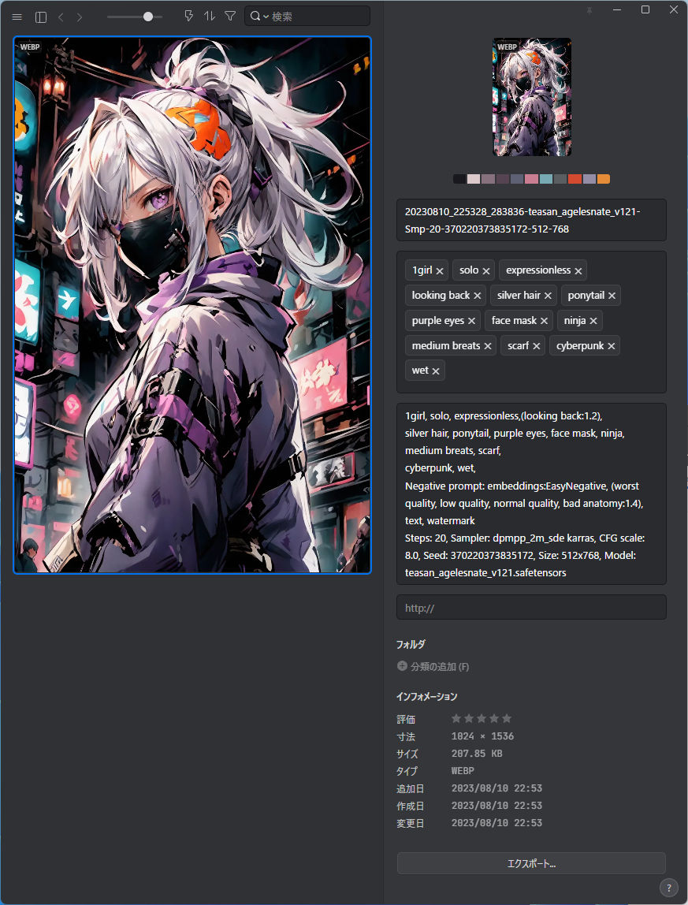

# ComfyUI-send-Eagle(slim)
[English README](README.md)

生成された画像を [Eagle](https://en.eagle.cool/) へ webp形式で連携する [ComfyUI](https://github.com/comfyanonymous/ComfyUI) 用 拡張ノードです。本拡張ノードは前作 [ComfyUI-send-Eagle](https://github.com/shingo1228/ComfyUI-send-eagle) のEagle連携機能を、本ノードに必要な機能に絞って実装し直したものです。 
今後、[ComfyUI-send-Eagle](https://github.com/shingo1228/ComfyUI-send-eagle) は更新終了予定です。

## 機能

入力:`image`で入力された生成画像を、webp形式でローカルで起動中のEagleに連携します。 
webp形式は非可逆圧縮（画質設定）、及び可逆圧縮形式を選択可能です。 

この拡張ノードは、ComfyUIの出力ディレクトリに"YYYY-MM-DD"形式のサブフォルダを作成します。
画像ファイルのネーミングルールは、以下の通りで、私がAUTOMATIC1111氏のStableDiffusion webuiで使用している設定を踏襲しています。現在、このサブフォルダ作成処理は変更できません。 

./ComfyUI/output/YYYY-MM-DD/YYYYMMDD_HHMMss_SSSSSS-{`FinalImage_width`}-{`FinalImage_height`}.webp

ComfyUIでは、処理がそのノードに到達すると、暗黙的に`prompt`及び`extra_pnginfo`というオブジェクトを受け取ります。`prompt`には、json形式でワークフローのノード間連携情報が記録されています。また`extra_pnginfo`には、json形式でワークフローを構成するノードの詳細情報（ノードの名称、リスト項目、座標、大きさなど）が記録されています。この二つの情報を生成した画像ファイルに埋め込むことで、画像をComfyUIにドロップすることで生成時のノード構成を再現する機能を実現しています。

この拡張ノードでは、`prompt`及び`extra_pnginfo`の情報から以下の機能を実現しています。

- `prompt`及び`extra_pnginfo`をwebp形式のexif情報に埋め込み、画像ドロップによるワークフローの再現

- `send_prompt`を有効にした場合、`prompt`のjson情報を解析し、`KSampler`ノード及び`KSamplerAdvanced`ノード（以下、生成基準ノード）から以下の生成情報をEagleのメモ欄（annotation）に登録
   - 「生成Step数」「サンプラー名」「スケジューラ名」「CFCスケール」「Seed値」
   - 生成基準ノードの入力:`latent`の上流ノード（`Empty Latent Image`ノードを想定）から、Latentの「幅」と「高さ」
   - 生成基準ノードの入力:`model`の上流ノードから「モデル名」（中間に`Load LoRA`ノードが存在していた場合は無視して`ckpt_name`を再帰的に探しにいきます）
   - 生成基準ノードの入力：`positive`及び`negative`の上流ノードから「生成プロンプト」「ネガティブプロンプト」
   - `CLIPTextEncodeSDXL`を使用していた場合、`text_g`と`text_l`の内容が同一であった場合は`text_g`の内容を「生成プロンプト（書式:text_g:{text_g} text_l:{text_l}）」とします
   - これらの情報を、以下の書式でEagleのメモ欄（annotation）に連携 
      {`prompt`} NegativePrompt:{`NegativePrompt`} "Steps: {`steps`}, Sampler: {`sampler_name`} {`scheduler`}, CFG scale: {`cfg`}, Seed: {`seed`}, Size: {`width`}x{`height`}, Model: {`model_name`}"

   - これらの情報を基に、以下のネーミングルールでファイル名を生成 
     YYYYMMDD_HHMMss_SSSSSS-{`model_name`}-Smp-{`steps`}-{`seed`}-{`FinalImage_width`}-{`FinalImage_height`}.webp

   - `prompt`から解析した「生成プロンプト」を分割しタグとしてEagleのタグ（tags）に登録

## 制限事項
- ワークフロー内で複数の`KSampler`ノード、及び`KSamplerAdvanced`ノードが存在した場合、暗黙的に採番されているノード番号（正式項目名は不明）が最小の物を生成基準ノードとします。これはSamplerノードの目的が「生成用」「Refiner用」「Hires.fix用」なのか区別出来ないためです。よって「生成用」のプロンプトと、「Hires.fix用」のプロンプトが異なって定義されているといったワークフローの場合、目的の生成プロンプトが取得できない可能性があります。
- 動作確認したノードはComfyUI標準のノードのうち、以下となります。
   - Sampler：`KSampler`,`KSamplerAdvanced`
   - Latentイメージ：`Empty Latent Image`
   - CLIP：`ClIP TextEncoder(Prompt)`,`CLIPTextEncodeSDXL`
- 動作確認した拡張ノードは以下となります。
   - Latentイメージ: [ComfyUI-SDXL-EmptyLatentImage](https://github.com/shingo1228/ComfyUI-SDXL-EmptyLatentImage)
- 暫定対応した拡張ノード
   - Sampler: `KSampler With Refiner (Fooocus)`
   - Prompt: `SDXL Prompt Styler`

- 上記、標準ノードでワークフローが構成されていた場合でも、ComfyUIは構成の自由度が非常に高いため、期待する情報を取得できない可能性があります。（その場合、対応が困難、若しくは論理的に対応できない可能性があります）
- 上記以外のノード（標準、拡張問わず）については、私が使いたい機能を持ったノードから動作確認、対応を進めていきます

## インストール
1. Navigaate to ComfyUI custom nodes directory
2. `git clone https://github.com/shingo1228/ComfyUI-send-eagle`
## 更新
1. Navigate to the cloned repo e.g. `custom_nodes/ComfyUI-send-eagle`
2. `git pull`
## 変更履歴
- 2023/08/17 初期版リリース
- 2023/08/18 `KSampler With Refiner (Fooocus)`,`SDXL Prompt Styler` に暫定対応
- 2023/08/22 `prompt`情報を解析しEagleに送信するフラグを追加
- 2023/08/31 `prompt`、`extra_pnginfo`を**Eagleに送らない（send_promptをdisable）**をデフォルトに変更