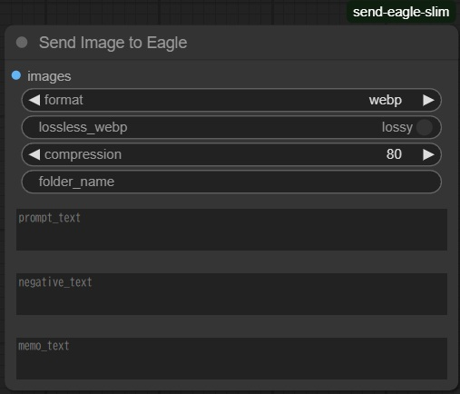

# ComfyUI-send-Eagle(slim)
[Japanese README](README.ja.md)

This is an extension node for [ComfyUI](https://github.com/comfyanonymous/ComfyUI) that allows you to send generated images to [Eagle](https://en.eagle.cool/). This extension node is a re-implementation of the Eagle linkage functions of the previous [ComfyUI-send-Eagle](https://github.com/shingo1228/ComfyUI-send-eagle) node, focusing on the functions required for this node.

## Features

Sends the image inputted through `image` in webp or png format to Eagle running locally. 
You can choose between lossy compression (quality settings) and lossless compression for webp.

- **Flexible Text Inputs**: You can directly input `prompt_text`, `negative_text`, and `memo_text` to be used as annotation and tags in Eagle. These inputs are now optional.
- **Custom Folder Selection**: Specify a `folder_name` in Eagle where the images will be saved. If the folder does not exist, the image will be saved to the root folder.
- **PNG Metadata Preservation**: When saving images in PNG format, `prompt` and `extra_pnginfo` are embedded as metadata, allowing workflow recreation by dragging the image back into ComfyUI.

## Installation
1. Navigate to ComfyUI custom nodes directory
2. `git clone https://github.com/shingo1228/ComfyUI-send-eagle-slim.git`

## Configuration
This extension node uses `config.json` for some settings. A template file `config.json.template` is provided in the extension's root directory.

To customize settings:
1. Copy `config.json.template` to `config/default_config.json` in the `config` directory.
2. Edit `config/default_config.json` to adjust parameters.

If `config/default_config.json` is not found, default settings will be used.

## Update
1. Navigate to the cloned repo e.g. `custom_nodes/ComfyUI-send-eagle-slim`
2. `git pull`

## Change History
- 2023/08/17 Initial release.
- 2023/08/18 Provisional Implementation support for `KSampler With Refiner (Fooocus)`,`SDXL Prompt Styler`.
- 2023/08/22 Added flag to parse `prompt` information and send to Eagle.
- 2023/08/31 Changed `prompt` and `extra_pnginfo` to default to **not send to Eagle (disable send_prompt)**.
- 2024/01/25 Add New Node "Send Eagle with text"
- 2024/07/20 Refactor project structure for improved modularity and maintainability.
- 2024/07/20 Make `prompt_text` and `negative_text` optional inputs in the node UI.
- 2024/07/20 Add `folder_name` input to specify target folder in Eagle.
- 2024/07/20 Implement PNG image saving with metadata preservation.
- 2024/07/20 Add unit and integration tests for Eagle client functionality.
- 2024/07/20 Rollback automatic folder creation due to API limitations.